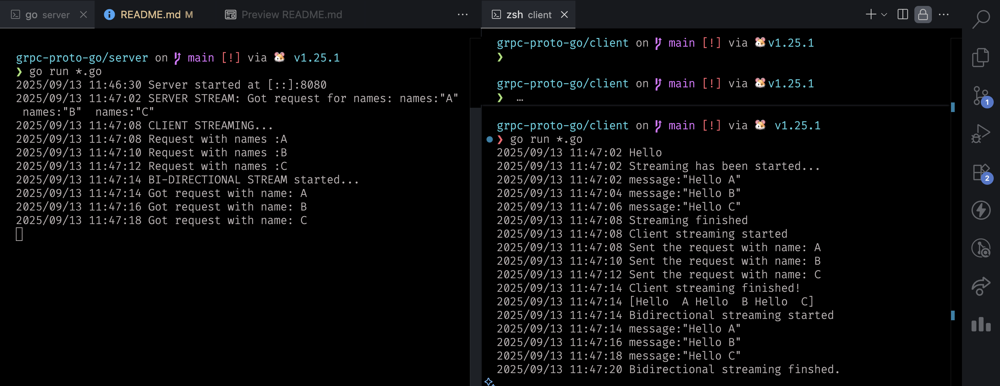

# gRPC Proto Go Example

This repository demonstrates how to use **Protocol Buffers** (`.proto` files) and **gRPC** in **Go**, including support for

- Unary API
- Server Streaming API
- Client Streaming API
- Bi-Directional Streaming RPC API

---

## 🚀 Prerequisites

Ensure the following tools are installed:

- [Go](https://golang.org/doc/install)
- [Protocol Buffers Compiler (`protoc`)](https://grpc.io/docs/protoc-installation/)

Install `protoc` using Homebrew (macOS):

```bash
brew install protoc
```

Verify the installation:

```bash
protoc --version
```

---

## ⏳ Getting Started

### 1️⃣ Clone the Repository

```bash
git clone https://github.com/Prayag2003/grpc-proto-go.git
cd grpc-proto-go
```

### 2️⃣ Install dependencies:

```bash
go mod tidy
```

---

## ⚙️ Generate Go Code from Proto

Generate the Go bindings from the proto file:

```bash
protoc --go_out=. --go-grpc_out=. proto/greet.proto
```

This creates:

- `proto/greet.pb.go`
- `proto/greet_grpc.pb.go`

---

## ▶️ Running the Example

### ✅ Start the Server

```bash
cd server
go run *.go
```

### ✅ Run the Client

Open a separate terminal:

```bash
cd client
go run *.go
```

---

## 📁 Project Structure

```text
grpc-proto-go/
├── assets/
│   └── response.png
├── client/
│   ├── bi_stream.go
│   ├── client_stream.go
│   ├── main.go
│   ├── server_stream.go
│   └── unary.go
├── proto/
│   ├── greet_grpc.pb.go
│   ├── greet.pb.go
│   └── greet.proto
├── server/
│   ├── bi_stream.go
│   ├── client_stream.go
│   ├── main.go
│   ├── server_stream.go
│   └── unary.go
├── go.mod
├── go.sum
└── README.md
```

---

## 📋 Proto Definition Example

```proto
syntax = "proto3";

option go_package = "./proto";

package greet_service;

service GreetService {
    rpc SayHello(NoParam) returns (HelloResponse);
    rpc SayHelloFromServerStreaming(NamesList) returns (stream HelloResponse);
    rpc SayHelloFromClientStreaming(stream HelloRequest) returns (MessagesList);
    rpc SayHelloBidirectionalStreaming(stream HelloRequest) returns (stream HelloResponse);
}

message NoParam {}
message HelloRequest { string name = 1; }
message HelloResponse { string message = 1; }
message NamesList { repeated string names = 1; }
message MessagesList { repeated string messages = 1; }
```

---

## 🎯 Response



---
